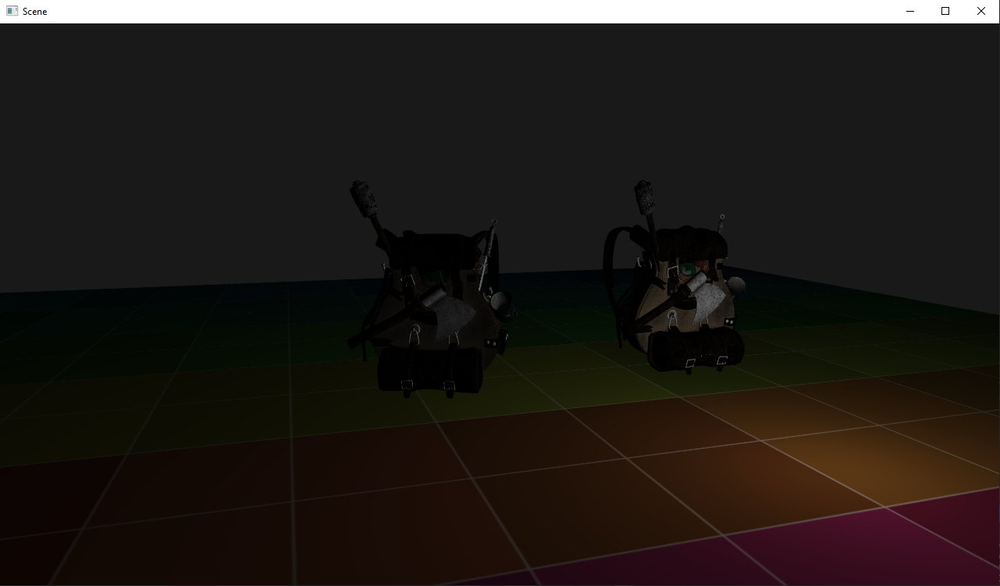
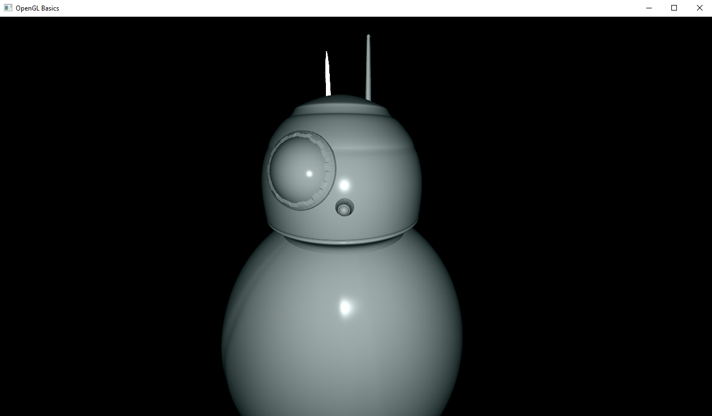

# EdGL a very basic OpenGL renderer
Work in progress *OpenGL **mini** renderer* written in C++.

This project does not aim to create an high quality engine/renderer (obviously), the goal here is to learn as much as possible about the basics of a basic renderer.

## Features implemented
* **Very basic** wrapper classes for OpenGL API: 
    * Window setup
    * VertexBuffer / IndexBuffer / VertexArray
    * GLSL Shader compiler
* Assimp Mesh loader system
* Materials
* Phong lighting model
* Camera movement system

## How to build
Right now this project should be cross-platform but I only tested on Windows (x64) with MSVC 2019. 
* C++17 required
* CMake version >=3.5

For downloading the project:
```bash 
git clone --recursive https://github.com/edu-rinaldi/EdGL-Renderer
```

For building it:
```bash
cd EdGL-Renderer
mkdir build && cd build
cmake ..
 ```

 Or for a better (?) experience just use CMake-GUI.

## Example image


<!--  -->